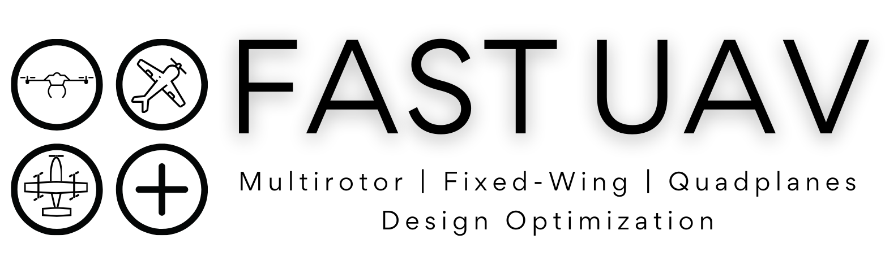

<p align="center">
    
</p>

Future Aircraft Sizing Tool - Unmanned Aerial Vehicles
===============================================================

<div align="center">
    <a href="#">
        
    </a>
    <a href="#">
        
    </a>
</div>
<br>


<b>FAST-UAV</b> is a Python tool dedicated to optimal drone design with a multi-disciplinary approach.

Based on the [FAST-OAD](https://github.com/fast-aircraft-design/FAST-OAD) and [OpenMDAO](https://openmdao.org/) frameworks, it allows to easily switch between models to address different types of configurations. 

Currently, FAST-UAV is bundled with analytical models for multi-rotor, fixed-wing and quad-plane (hybrid VTOL) UAVs.

🚀 Quick start
-------

FAST-UAV requires a version of Python higher than 3.8. The installation can be done using the `pip` command:

```{.bash}
pip install fastuav
```

Now that FAST-UAV is installed, you can start using it through [Jupyter notebooks](https://jupyter.org/):
```{.bash}
jupyter lab
```
Jupyter lab will open automatically in your browser. Then, navigate to the `src/fastuav/notebooks` directory and start with the first tutorial notebook.

**Note**: It is recommended to install FAST-UAV in a virtual environment ([conda](https://docs.conda.io/en/latest/), [venv](https://docs.python.org/3/library/venv.html)...)

📚 Citation
------------
If you use FAST-UAV as part of your work in a scientific publication, please consider citing the following papers:
```
@inproceedings{pollet2022common,
    title = {A common framework for the design optimization of fixed-wing, multicopter and {VTOL} {UAV} configurations},
    author = {Pollet, F{\'e}lix and Delbecq, Scott and Budinger, Marc and Moschetta, Jean-Marc and Liscou{\"e}t, Jonathan},
    booktitle = {33rd {Congress} of the {International} {Council} of the {Aeronautical} {Sciences}},
    address = {Stockholm, Sweden},
    month = sep,
    year = {2022},
}

@inproceedings{pollet2021design,
    title = {Design optimization of multirotor drones in forward flight},
    author = {Pollet, F{\'e}lix and Delbecq, Scott and Budinger, Marc and Moschetta, Jean-Marc},
    booktitle = {32nd {Congress} of the {International} {Council} of the {Aeronautical} {Sciences}},
    address = {Shanghai, China},
    month = sep,
    year = {2021},
}

@article{delbecq2020efficient,
	title = {Efficient sizing and optimization of multirotor drones based on scaling laws and similarity models},
	author = {Delbecq, Scott and Budinger, Marc and Ochotorena, Aithor and Reysset, Aur{\'e}lien and Defay, Francois},
	journal = {Aerospace Science and Technology},
	volume = {102},
	doi = {10.1016/j.ast.2020.105873},
	month = jul,
	year = {2020},
	pages = {105873},
```


🔥 Related publications
------------
> M. Budinger, A. Reysset, A. Ochotorena, and S. Delbecq. Scaling laws and similarity models for the preliminary design of multirotor drones. Aerospace Science and Technology, 2020, 98, pp.1-15. https://doi.org/10.1016/j.ast.2019.105658. https://hal.science/hal-02997598.

> S. Delbecq, M. Budinger, A. Ochotorena, A. Reysset, and F. Defay. Efficient sizing and optimization of multirotor drones based on scaling laws and similarity models. Aerospace Science
and Technology, 2020, 102, pp.1-23. https://doi.org/10.1016/j.ast.2020.105873. https://hal.science/hal-02997596.

> F. Pollet, S. Delbecq, M. Budinger, and J.-M. Moschetta. Design optimization of multirotor drones in cruise. 32nd Congress of the International Council of the Aeronautical Sciences, Sep 2021, Shanghai, China. https://hal.science/hal-03832135/.

> S. Delbecq, M. Budinger, C. Coic, and N. Bartoli. Trajectory and design optimization of multirotor drones with system simulation. AIAA Scitech 2021 Forum, Jan. 2021, VIRTUAL EVENT, United States. https://doi.org/10.2514/6.2021-0211. https://hal.science/hal-03121520.

> J. Liscouet, F. Pollet, J. Jézégou, M. Budinger, S. Delbecq, and J.-M. Moschetta. A Methodology to Integrate Reliability into the Conceptual Design of Safety-Critical Multirotor Unmanned Aerial Vehicles. Aerospace Science and Technology, 2022, 127, pp.107681. https://doi.org/10.1016/j.ast.2022.107681. https://hal.science/hal-03956142.

> F. Pollet, S. Delbecq, M. Budinger, J.-M. Moschetta, and J. Liscouët. A Common Framework for the Design Optimization of Fixed-Wing, Multicopter and VTOL UAV Configurations. 33rd Congress of the International Council of the Aeronautical Sciences, Sep. 2022, Stockholm, Sweden. https://hal.science/hal-03832115/

> F. Pollet, M. Budinger, S. Delbecq, J. -M. Moschetta, and J. Liscouët. Quantifying and Mitigating Uncertainties in Design Optimization Including Off-the-Shelf Components: Application to an Electric Multirotor UAV. Aerospace Science and Technology, 2023, pp.108179. https://doi.org/10.1016/j.ast.2023.108179.

>  F. Pollet, M. Budinger, S. Delbecq, J. -M. Moschetta, and T. Planès. Environmental Life Cycle Assessments for the Design Exploration of Electric UAVs. Aerospace Europe Conference 2023 – 10th EUCASS – 9th CEAS, Jul. 2023, Lausanne, Switzerland. https://doi.org/10.13009/EUCASS2023-548. https://hal.science/hal-04229799.

> [DroneApp](https://github.com/SizingLab/droneapp-legacy) sizing tool


📝 License
------------
The software is released under <a href="https://www.gnu.org/licenses/gpl-3.0.en.html"> The GNU General Public License v3.0</a>.


🤝 Questions and contributions
------------
Feel free to contact us if you have any question or suggestion, or if you wish to contribute with us on FAST-UAV!
* Scott DELBECQ [scott.delbecq@isae-supaero.fr](scott.delbecq@isae-supaero.fr)
* Félix POLLET [felix.pollet@isae-supaero.fr](felix.pollet@isae-supaero.fr)